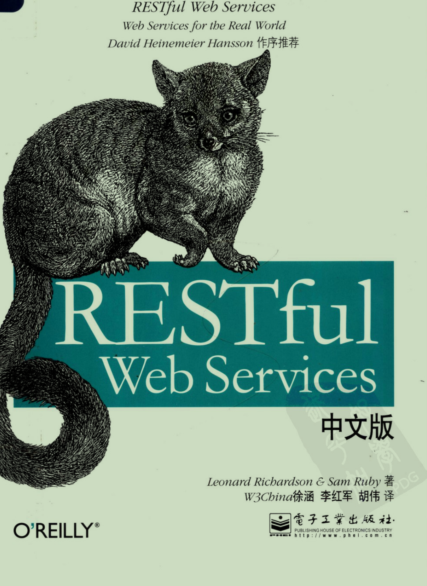

# 开篇词

## 引言

“十年后的今天，我终于学会了RESTful API。”

以上，就是我最近一个月的心路历程。入职新公司不到2周，自己都还没完全理解RESTful API就要求给校招应届生培训，着实压力山大。培训结束后也感觉收获颇丰，遂总结分享出来，希望对你有所帮助。

网上的文章比较零散，大多数讲 RESTful API 都是浅尝辄止，看完后我的印象只停留在：

- HTTP方法代表操作（如GET表示查询，POST代表新增，DELETE代表删除，PUT代表修改）
- HTTP状态码代表结果（如200代表成功）

这些很浅的层面，似乎相比 GET/POST 一把梭，不管成功还是失败都返回 200 状态码，然后通过body中的 code 或 msg 判断结果好像没有多出什么好处？

所以，我为什么要用 RESTful API风格？

## REST 和 Web

2000年，HTTP规范的主要作者之一，菲尔丁发表了博士论文[《基于网络的软件体系结构风格与设计》](https://www.ics.uci.edu/~fielding/pubs/dissertation/top.htm)，首次提出了名为“表现层状态转移”（REST）的互联网体系架构：


  
但是直到2008年，《RESTful Web Services》一书的推出，才系统性的讲述了如何设计REST式API风格：



在本书中，作者将其称之为面向资源的架构（Resources-Oriented-Architecture，简称ROA），也是本书的最大两点，补齐了我在 RESTful 理论知识方面的不足：


  
那么，既然面试用不到，还有啥必要学这个东西？

面试会考代码规范吗？不会，重要吗？很重要，所以 RESTful 本质上就是一种规范，一种专门用于 HTTP API 设计的规范。

下面举一些例子来加深一下理解。

## 那些有争议的API设计

> 声明：虽然作者提倡使用 RESTful 规范来设计 HTTP API，但是目前国内互联网大厂都不统一，故我们应当理解下面介绍的案例，其必定有自己的背景和理由。

### 所有的接口都使用 POST 请求

你可能听过或者刷到过这样的段子，同样 v2ex 上也有这样一个[帖子](https://www.v2ex.com/t/830030?p=1)，讨论的热火朝天：

对接同事的接口，他定义的所有接口都是 post 请求，理由是 https 用 post 更安全。

之前习惯使用 restful api ，如果说 https 只有 post 请求是安全的话？那为啥还需要 get 、put 、delete ？我该如何反驳他。

其中网友的回复有以下几种观点：

- POST挺好的，就应该这么干，沟通少
- 一把梭，早点干完早点回家
- 吵赢了又怎么样？工作而已，优雅不能当饭吃。虽然评论没有一边倒，但是也有大量的人支持

我搜索了下，觉得这个[回答](https://juejin.cn/post/7129685508589879327)比较靠谱点：

- 如果你的团队都是大佬，或者有着良好的团队规范，所有人都在平均水平线之上，并且有良好的纠错机制，那基本不会制定这样的规则。但如果团队成员水平参差不齐，尤其是小团队，创业团队，常常上来就开干，没什么规范，纯靠开发者个人素质决定代码质量，这样的团队就不得不制定这样的规范。
- 毕竟可以减少非常多的问题，Post不用担心URL长度限制，也不会误用缓存。通过一个规则减少了出错的可能，这个决策性价比极高。
- 造成的结果：公司有新人进来，什么垃圾公司，还有这种要求，回去就在群里讲段子。
- 实际上都是有原因的，有些外包公司或者提供第三方接口的公司也会选择只用Post，就是图个方便。

从这些回答中，我认为2个最重要的原因是：避免踩GET的坑、降低沟通成本。

但程序员宝贵的不就是这些经验教训吗？所以，这个规定的受益方是公司，对个人而言没有任何好处：它没有让你学习到任何有用的知识！甚至会让你误认为HTTP就应该这样干，从而失去了深入学习 HTTP 和 RESTful API 的机会。

我们会在下一章中深入探讨这个问题。

### HTTP状态码永远返回200

HTTP 是请求-响应的通讯模型，对于客户端的请求操作，服务端需要告诉客户端操作结果。

以新增用户接口为例，曾经我是这样干的：
请求：

```json
POST /userManager/addUser
{
   "userName":"admin",
   "nickName":"管理员",
   "userPwd":"pwd"
}
```

响应：

```json
{
   "errorCode":0,
   "errorMsg":"success"
}
```

如果是查询类的接口，则除了错误码和错误描述，响应结果中会多出一个 data 字段，用来放实际的业务数据：

```json
{
   "errorCode":0,
   "errorMsg":"success",
   "data":{
      "total":0,
      "entries":[]
   }
}
```
  
这样的做法有2个缺陷：

- 数据冗余：`HTTP 是应用层协议`，已经有状态码表示操作结果了，我们又定义一个，未免太多余，白白多花流量钱，浪费带宽。另外，这种设计也体现了API设计者是把  HTTP 当作传输协议来使用，没有充分利用 HTTP 应用层协议的特性。
- 重复造轮子：为了区分不同的错误原因，我们要精心规划 errorCode ，比如0代表成功，1000-2000 代表一种失败原因，2000-3000代表另外一种。有没有发现其实 HTTP 本身已经给我们设计好了？2xx代表成功，3xx跳转，4xx代表客户端原因导致的错误（参数非法），5xx代表服务端出错。

另外，这种做法最大的问题是：监控系统在一种低效的状态下工作。

它需要把所有的网络请求包打开后才知道是否是错误，而且完全不知道是调用端出错还是服务端出错。于是一些像重试或熔断这样的控制系统完全不知道怎么搞（如果是 4xx 错误，那么重试或熔断是没有意义的，只有 5xx 才有意义）。

### API命名千奇百怪

没有学习 RESTful API 规范之前，我会用 URI 来表示 API 的具体作用。

所以在设计API的名字时，我们通常会通过动词来代表具体的操作，比如新增是add，删除是delete，修改是update，但是查询的翻译就难了，有些人用query，有些人有select。

这是因为开发者对API接口设计的习惯不同，以新增员工举例，可能会出现这种情况：

```bash
http://localhost:/employee/save
http://localhost:/employee/add
http://localhost:/employee/new
http://localhost:/employee/xinzeng
http://localhost:/employee/append
http://localhost:/employee?cmd=add
```

而且请求方法和响应结果可能也是很随意的。

所以，如何设计一套科学的API接口？答案：具有 RESTful 风格的API接口。

## 一些区别

### REST 和 RESTful API 的关系

网络上经常会有人搞混，分不清 REST 和 RESTful API 的关系，所以这里

### REST 和 HTTP 的关系

## 参考

- 为什么有公司规定所有接口都用Post？[https://juejin.cn/post/7129685508589879327](https://juejin.cn/post/7129685508589879327)
- 一把梭：REST API 全用 POST？[https://coolshell.cn/articles/22173.html](https://coolshell.cn/articles/22173.html)
- 对接同事的接口，他定义的所有接口都是 post 请求，理由是 https 用 post 更安全：[https://www.v2ex.com/t/830030?p=1](https://www.v2ex.com/t/830030?p=1)